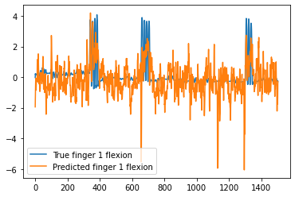
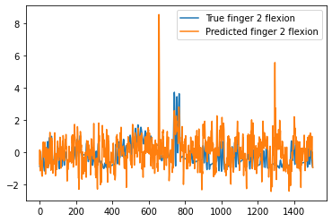
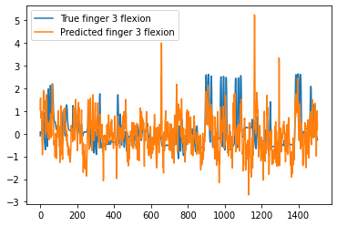
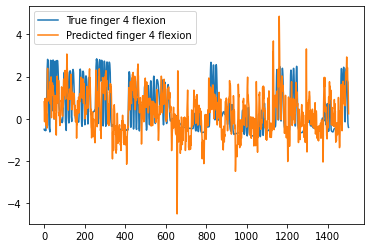
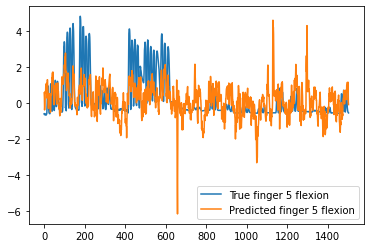

## Finger Flexion Prediction with Intracranial EEG
This project aims to predict finger flexion using intracranial electroencephalography (EEG) data. By leveraging machine learning models and signal processing techniques, the project aims to develop a Brain-Computer Interface (BCI) system that can interpret brain signals and predict finger movements.

### Introduction
The Finger Flexion Prediction with Intracranial EEG project is part of a Brain-Computer Interface course project. The goal is to decode brain signals obtained through intracranial EEG and predict finger flexion. This research has potential applications in the field of neuroprosthetics, where it can help individuals with motor disabilities regain mobility and independence.

### Dataset
The project utilizes a dataset of intracranial EEG recordings collected from human subjects. The dataset includes neural signals captured while participants perform finger flexion tasks. The data is preprocessed and segmented into windows to extract relevant features for training the machine learning models.

### Methods
The project employs a combination of signal processing techniques and machine learning algorithms to predict finger flexion based on intracranial EEG data. The preprocessing steps involve windowing the data and extracting features using time-domain and frequency-domain analysis. The feature vectors are then used to create a correlation matrix (R matrix) that captures the relationships between the EEG signals and finger flexion.

The machine learning models utilized in this project include linear regression and gradient boosting models. These models are trained on the R matrix and the corresponding finger flexion labels. The trained models are then used to make predictions on unseen EEG data.

### Results
The project achieved promising results in predicting finger flexion using intracranial EEG data. The developed machine learning models achieved a correlation coefficient of up to 0.45, indicating a moderate association between the EEG signals and finger flexion. These results demonstrate the potential of using intracranial EEG for predicting and decoding motor movements.

## Author

- [Li-Pu Chen](mailto:phil.lipuchen@gmail.com)

---

